# WinterAdventurer

[](https://github.com/isaac-ecrs/WinterAdventurer/actions)

A workshop/class registration management system for [ECRS](https://ecrs.org) Winter Adventure events. Import Excel spreadsheets from Cognito Forms and generate professional PDFs for workshop leaders and participants.

**Note:** This tool is specifically designed for ECRS Winter Adventure events and expects Excel data in the format exported from our Cognito Forms registration system. While the code is open source and contributions are welcome, it may require modification for other use cases.

## Features

- 📊 **Excel Import** - Schema-driven parsing of ECRS Cognito Forms registration data
- 📄 **PDF Generation** - Three document types:
  - Class rosters for workshop leaders
  - Individual schedules for participants
  - Master schedule grid showing all workshops
- ✏️ **Interactive Editing** - Edit workshop details (names, leaders), manage locations and timeslots
- 💾 **Data Persistence** - Locations and custom timeslots saved between sessions
- 🎨 **Professional Output** - Custom fonts, ECRS logo, optimized for B&W printing
- 🌙 **Dark Mode** - Toggle between light and dark themes

## Quick Start

### Download Pre-built Binary (Easiest)

1. Download the latest release for your OS from [Releases](https://github.com/isaac-ecrs/WinterAdventurer/releases)
2. Extract the zip file
3. Run the executable:
   - **Windows**: Double-click `WinterAdventurer.exe`
   - **Linux/macOS**: Run `./WinterAdventurer` in terminal
4. Open your browser to http://localhost:5001

### Run from Source

```bash
# Clone the repository
git clone https://github.com/isaac-ecrs/WinterAdventurer.git
cd WinterAdventurer

# Run the web application
cd WinterAdventurer
dotnet run

# Navigate to https://localhost:5001
```

### Command-Line Interface (CLI)

For automated/batch processing without the web UI.

#### Usage

```bash
cd WinterAdventurer.CLI
dotnet run -- <excel-file> [--timeslots <json-file>] [--no-merge-workshops] [--blank-schedules <count>] [--event-name <name>]
```

**Arguments:**
- `<excel-file>` - Path to Excel registration file (required)

**Options:**
- `--timeslots <json-file>` - Path to JSON file with timeslot configuration (optional)
- `--no-merge-workshops` - Disable cell merging in individual schedules (optional)
- `--blank-schedules <count>` - Number of blank schedules to generate for walk-in attendees (optional)
- `--event-name <name>` - Event name to display in PDF footer (optional, defaults to "Winter Adventure {current year}")

#### Examples

**Basic usage (uses default timeslots):**
```bash
dotnet run -- "/path/to/registrations.xlsx"
```

**With custom timeslots (recommended):**
```bash
dotnet run -- "/path/to/registrations.xlsx" --timeslots "example-timeslots.json"
```

**With blank schedules for walk-in attendees:**
```bash
dotnet run -- "/path/to/registrations.xlsx" --timeslots "timeslots.json" --blank-schedules 10
```

**With custom event name:**
```bash
dotnet run -- "/path/to/registrations.xlsx" --timeslots "timeslots.json" --event-name "Winter Adventure 2025"
```

**All options:**
```bash
dotnet run -- "/path/to/registrations.xlsx" --timeslots "timeslots.json" --no-merge-workshops --blank-schedules 10 --event-name "Winter Adventure 2025"
```

#### Timeslot Configuration

The `--timeslots` option adds schedule times to your PDFs. Without it, PDFs show period names but no times.

**Example JSON format** (see `WinterAdventurer.CLI/example-timeslots.json`):
```json
{
  "timeslots": [
    {
      "id": "period-morning-first",
      "label": "Morning First Period",
      "startTime": "09:00:00",
      "endTime": "10:30:00",
      "isPeriod": true
    },
    {
      "id": "custom-lunch",
      "label": "Lunch",
      "startTime": "12:15:00",
      "endTime": "13:15:00",
      "isPeriod": false
    }
  ]
}
```

**Important:** `label` must exactly match period names from your Excel schema (e.g., "Morning First Period", "Afternoon Period").

#### Output

PDFs are generated in the same directory as the input Excel file:
- `ClassRosters.pdf` - Workshop rosters for leaders

## Usage

### Web App Workflow

```mermaid
flowchart TD
    Start([User Opens Web App]) --> Upload[Upload Excel File]
    Upload --> Parse{Parse Successfully?}

    Parse -->|No| Error1[Show Error Message]
    Error1 --> Upload

    Parse -->|Yes| Display[Display Workshop Cards]
    Display --> LoadData[Load Saved Locations<br/>& Timeslots from DB]
    LoadData --> EditPhase{Want to Edit?}

    EditPhase -->|Yes| Edit[Edit Workshop Details]
    Edit --> EditOptions{What to Edit?}

    EditOptions --> EditWorkshop[Edit Names/Leaders]
    EditOptions --> EditLocation[Assign Locations<br/>with Autocomplete]
    EditOptions --> EditTimeslot[Configure Timeslot Times]
    EditOptions --> AddTimeslot[Add Custom Timeslots<br/>Lunch, Breaks, etc.]

    EditWorkshop --> SaveEdit[Changes Auto-Save]
    EditLocation --> SaveEdit
    EditTimeslot --> SaveTimeslot[Click 'Save Times']
    AddTimeslot --> SaveTimeslot

    SaveEdit --> EditPhase
    SaveTimeslot --> EditPhase

    EditPhase -->|No, Ready to Generate| Validate{Validate Timeslots}

    Validate -->|Overlaps Found| ErrorOverlap[❌ Show Error Alert<br/>PDF Buttons Disabled]
    Validate -->|Unconfigured Periods| ErrorConfig[❌ Show Error Alert<br/>PDF Buttons Disabled]

    ErrorOverlap --> FixTimeslots[Fix Overlapping Times]
    ErrorConfig --> FixTimeslots
    FixTimeslots --> SaveTimeslot

    Validate -->|✅ All Valid| Generate[✅ PDF Buttons Enabled]

    Generate --> ChoosePDF{Choose PDF Type}

    ChoosePDF --> ClassRoster[Generate Class Rosters]
    ChoosePDF --> MasterSchedule[Generate Master Schedule]

    ClassRoster --> Download1[Download ClassRosters.pdf]
    MasterSchedule --> Download2[Download MasterSchedule.pdf]

    Download1 --> Done([Complete])
    Download2 --> Done

    %% Styling
    classDef errorStyle fill:#ffcccc,stroke:#cc0000,stroke-width:2px,color:#000
    classDef successStyle fill:#ccffcc,stroke:#00cc00,stroke-width:2px,color:#000
    classDef editStyle fill:#cce5ff,stroke:#0066cc,stroke-width:2px,color:#000
    classDef validateStyle fill:#fff4cc,stroke:#ccaa00,stroke-width:2px,color:#000

    class Error1,ErrorOverlap,ErrorConfig errorStyle
    class Generate,Download1,Download2,Done successStyle
    class Edit,EditOptions,EditWorkshop,EditLocation,EditTimeslot,AddTimeslot,SaveEdit,SaveTimeslot editStyle
    class Validate,FixTimeslots validateStyle
```



### Quick Steps

1. **Upload Excel File** - Click "Choose File" and select your ECRS Cognito Forms registration export
2. **Review Workshops** - See all parsed workshops and participants
3. **Edit Details** (Optional) - Update workshop names, leaders, and locations as needed
4. **Customize Schedule** (Optional) - Adjust timeslot times and add custom activities
5. **Validate** - System checks for overlapping or unconfigured timeslots
6. **Generate PDFs** - Download class rosters or master schedule once validation passes

## Excel Format Requirements

**Important:** This tool expects Excel data in the specific format exported from ECRS Cognito Forms registration system for Winter Adventure events.

The system uses a schema-driven parser. See `WinterAdventurer.Library/EventSchemas/WinterAdventureSchema.json` for the expected Excel structure.

Key requirements:
- **ClassSelection sheet**: Attendee roster with registration IDs, names
- **Period sheets**: Workshop selections by period (e.g., MorningFirstPeriod, AfternoonFirstPeriod)
- Column pattern matching supported for flexibility across years

## Technology Stack

- **.NET 9** - Cross-platform runtime
- **Blazor Server** - Interactive web UI
- **MudBlazor** - Material Design component library
- **EPPlus** - Excel parsing
- **PDFsharp + MigraDoc** - PDF generation
- **Entity Framework Core** - SQLite database for persistence
- **Serilog** - Structured logging
- **Playwright** - Browser automation for E2E testing

## Development

### Prerequisites

- [.NET 9 SDK](https://dotnet.microsoft.com/download/dotnet/9.0)

### Build

```bash
dotnet build
```

### Test

Run all tests (unit + E2E):
```bash
dotnet test
```

Run only unit tests (faster, no browser required):
```bash
dotnet test --filter "FullyQualifiedName!~E2ETests"
```

Run only E2E tests:
```bash
dotnet test --filter "FullyQualifiedName~E2ETests"
```

**Note:**
- E2E tests automatically start and stop the web server - no manual setup required
- E2E tests require Playwright browsers to be installed. See `WinterAdventurer.E2ETests/README.md` for setup instructions
- Unit tests run in CI; E2E tests run locally only

### Project Structure

```
WinterAdventurer/
├── WinterAdventurer/              # Blazor Server web UI
├── WinterAdventurer.Library/      # Core business logic
├── WinterAdventurer.CLI/          # Command-line interface
├── WinterAdventurer.Test/         # Unit tests
└── WinterAdventurer.E2ETests/     # End-to-end tests (Playwright)
```

## Configuration

### Custom Fonts

Place TTF files in `WinterAdventurer.Library/Resources/Fonts/` and update `CustomFontResolver.cs`.

### Organization Logo

Replace `WinterAdventurer.Library/Resources/Images/ECRS_Logo_Minimal_Gray.png` with your logo (grayscale recommended for B&W printing).

### Event Schema

Create a new JSON schema in `WinterAdventurer.Library/EventSchemas/` to match your Excel format.

## License

This project is licensed under the MIT License - see the LICENSE file for details.

## Contributing

Contributions welcome! Please open an issue or submit a pull request.

**For Contributors:** This project was built with [Claude Code](https://claude.ai/code). See [CLAUDE.md](CLAUDE.md) for detailed architecture notes and development guidance that work well with AI-assisted development.

## Support

- **Issues**: [GitHub Issues](https://github.com/isaac-ecrs/WinterAdventurer/issues)
- **Documentation**: See [CLAUDE.md](CLAUDE.md) for detailed architecture notes

---

Built for [ECRS](https://ecrs.org) Winter Adventure events using .NET 9, Blazor, and Claude Code.
